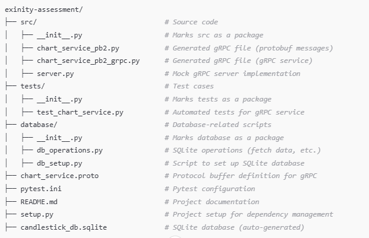

# Exinity Assessment: QA Automation – Trading Systems

This project demonstrates automation tests for a candlestick generation service via a gRPC interface. The service reads price tick data, aggregates it into OHLC candlesticks, streams the current bar to the client, and stores completed bars in a database.

The focus is on:
- **gRPC Interface Validation**
- **Candlestick Data Validation**
- **Database Integration Tests**

---

## **Project Overview**

### **1. Key Features**
- Validate `Subscribe` gRPC method for candlestick data streaming.
- Verify candlestick data integrity (OHLC values).
- Cross-check database entries to ensure no duplicate candlesticks.

### **2. Project Structure**



---

## **Setup Instructions**

### **1. Prerequisites**
- Python 3.8 or higher
- `pip` for Python package management

### **2. Install Dependencies**
Install the required libraries using:
```bash
pip install grpcio grpcio-tools pytest sqlite3
```

---

## **Usage**

### **1. Set Up the Database**
- Before running the server or tests, ensure the SQLite database is set up. Run the following command to initialize the database: `python database/db_setup.py`
- Expected Output: The script will create a file named `candlestick_db.sqlite` in the project root.
### **2. Start the gRPC Server**
- Run the gRPC server: `python src/server.py`
- Expected Output: `gRPC server started on port 50051`
### **3. Run the Tests**
- In a new terminal, execute the tests: `pytest tests/`

---

## **Key Files**

### **1. server.py**
- Implements a mock gRPC server streaming candlestick data.
### **2. test_chart_service.py**
- Tests the `Subscribe` gRPC method.
- Validates response data and cross-checks the database.
### **3. db_operations.py**
- Handles SQLite queries (e.g., fetch the last candlestick for a symbol).
### **4. chart_service.proto**
- Defines the gRPC service, requests, and responses:
```
service ChartService {
    rpc Subscribe(SubscribeRequest) returns (stream SubsribeResponse);
}

message SubscribeRequest {
    Timeframe timeframe = 1;
    repeated string symbol_list = 2;
}

message Candlestick {
    uint64 timestamp_msec = 1;
    double open = 2;
    double high = 3;
    double low = 4;
    double close = 5;
}

message SubsribeResponse {
    string symbol = 1;
    Candlestick bar = 2;
} 
```

